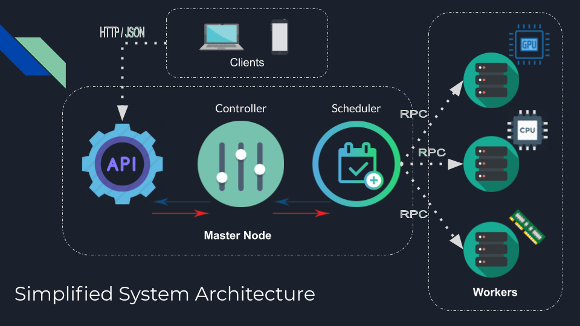

Challenge:  Second Term Partial
===============================

This is the second term challenge-based exam for the Distributed Computing Class. This is the beginning of 2 deliverables of your final challenge.
On this challenge you're developing the first part of your final project that will be a parallel image processing system.

A strong recomendation is that you develop your solution the most simple, readable, scalable and plugable as possible. In the following challenges you will
be integrating more services, so a well-defined design and implementation will make it easier to integrate new modules into your distributed application.

Distributed and Parallel Image Processing
-----------------------------------------



### First Phase for the Final Challage
This is going to be the first phase of design and implementation.
You're basically implementing the initial entry point for your Distributed and Parallel Image Processing System. Below the key points you're implementing on this challenge:

- *Initial API endpoints*
  - `/login` - user/password request, token-based authentication for granted users.
  - `/logout` - token-based request, token revocation.
  - `/upload` - simple image upload support, respond with image name, size and upload time.
  - `/status` - token-based request, Overall system status and logged user details.
- *Basic Authentication* - token-based authentication
- *Controller* (simple request validation and and simple response support)
- Image receiving support

**Documentation**
- A detailed arquitecture document will be required for this initial phase in the [architecture.md](architecture.md) file. Diagrams and charts can be included on this document.
- A detailed user guide must be written in the [user-guide.md](user-guide.md) file. This document explains how to install, configure and use your system.


Test Cases (from console)
-------------------------
Below you will see some examples of input and output on how your program will be tested.
Consider that outpot must be exactly as it's shown below.

- **Login**
```
$ curl -u username:password http://localhost:8080/login
{
	"message": "Hi username, welcome to the DPIP System",
	"token" "OjIE89GzFw"
}
```

- **Logout**
```
$ curl -H "Authorization: Bearer <ACCESS_TOKEN>" http://localhost:8080/logout
{
	"message": "Bye username, your token has been revoked"
}
```

- **Upload**
```
$ curl -F 'data=@/path/to/local/image.png' -H "Authorization: Bearer <ACCESS_TOKEN>" http://localhost:8080/upload
{
	"message": "An image has been successfully uploaded",
	"filename": "image.png",
	"size": "500kb"
}
```

- **Status**
```
$ curl -H "Authorization: Bearer <ACCESS_TOKEN>" http://localhost:8080/status
{
	"message": "Hi username, the DPIP System is Up and Running"
	"time": "2015-03-07 11:06:39"
}
```

Automated test suite
--------------------
Once your API is running you can run the above commands automatically with the following command:
```
make test
```


"Game" Rules
------------

- This is 2-person team challenge, keep the focus on you work.
- You're free to use the internet for coding references.
- Any attempt of plagiarism will not be tolerated.


General Submission Instructions
-------------------------------
1. Make sure your local repository is in sync with the origin remote repository before anything.
2. Commit and Push your code to your personal repository (fork) and branch (second-partial).

3. Once you're done, follow common lab's sumission process. More details at: [Classify API](../../classify.md)
```
make submit
```

Grading Policy
--------------

The grading policy is quite simple, most falls in the test cases. Below the percentages table:

| Concept                                | %    |
|----------------------------------------|------|
| Code Style best practices              | 20%  |
| Test Cases (15% per API endpoint)      | 60%  |
| Program meets with all requirements    | 20%  |
| TOTAL                                  | 100% |

Handy links
-----------
- [Gin Web Framework](https://github.com/gin-gonic/gin)
- [Postman](https://www.postman.com/)
- [Video: Basics of Using Postman](https://youtu.be/t5n07Ybz7yI)
- [Advanced REST client for Chrome browser](https://chrome.google.com/webstore/detail/advanced-rest-client/hgmloofddffdnphfgcellkdfbfbjeloo?hl=es-419)
