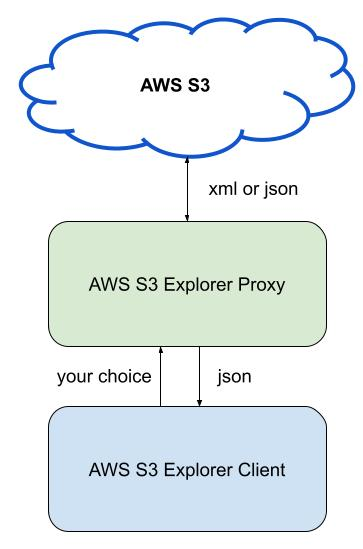

Lab - Amazon S3 Explorer
========================

This layered system  will be divided in 3 main components:

- AWS S3 Service (AWS manages it)
- AWS S3 Explorer (A proxy service that you manage)
- AWS S3 Client (A simple client that you manage)




AWS S3 Explorer
---------------

This program will serve as a proxy between your command-line client
and the AWS S3 service. It will provide a JSON-based API that will
receive a bucket name and optionally a directory name and then it will
return a constructed JSON message with the details about the bucket.

Your program will receive the name of a public bucket and then, it
will explore details about it in the XML that is provided by the AWS
API. The main idea of this forst part is to interact with the RESTFul
API that AWS is providing in order to get its objects and buckets
metadata.

Consider that this explorer can only go until the third level in the
directory tree. Don't go deeper, otherwise your program may run
forever in some cases.

**How to execute the AWS S3 Explorer** - Terminal 1

```
$ go run awsS3Explorer.go -port 8000
```


AWS S3 Client
-------------

This is going to be the client side, it will connect to the AWS S3
Explorer Proxy and will ask for details in a specific S3 bucket and optionally
a directory.

- Communication language `client -> proxy` can be in any format, it's your choice.

- Communication language `proxy -> client` must be in JSON.

**How to run the AWS S3 client**

Consider that the following executions are fake ones, results are not real.

- Only bucket specified case
```
$ go run awsS3Client.go -proxy localhost:8000 -bucket ryft-public-sample-data
{
    "BucketName":"ryft-public-sample-data",
    "ObjectsCount":1234,
    "DirectoriesCount":33,
    "Extensions":{
        "pdf":100,
        "xml":23,
        "docx":55,
        "txt":1232
    }
}
```

- Bucket and directory specified case
```
$ go run awsS3Client.go -proxy localhost:8000 -bucket ryft-public-sample-data -directory DNS
{
    "BucketName":"ryft-public-sample-data",
    "DirectoryName": "DNS"
    "ObjectsCount":124,
    "DirectoriesCount":3,
    "Extensions":{
        "pdf":10,
        "xml":3,
        "docx":1
    }
}
```


General Requirements and Considerations
---------------------------------------
- Use the `awsS3Explorer.go` and `awsS3Client.go` file for your implementation.
- **You must use an extense use of golang challenges in both programs**
- Don't forget to handle errors properly.
- Coding best practices implementation will be also considered.


Handy resources
---------------
- https://golang.org/pkg/net/http/
- https://golang.org/pkg/encoding/xml/
- https://golang.org/pkg/encoding/json/
- https://docs.aws.amazon.com/sdk-for-go/api/service/s3/ (optional)

Test Suite
----------
Build and Test automation is already implemented with the following command. Below some general tips and comments.

- Make sure that your program passes all test cases without errors.
- Remember that this is being executed by a robot script.
- You cannot edit the `lab.mk` file.
- Failed compilation or segmentation faults means 0-graded.
- Failed tests will be properly discounted from total grade.


Your layered-system will be executed in 2 terminals, once for the proxy and one for the client.

- **Terminal 1** (AWS S3 Explorer Proxy)

```
make proxy
```

- **Terminal 2** (AWS S3 Client)

```
make test
```

How to submit your work
=======================
```
make submit
```
More details at: [Classify API](../../classify.md)
