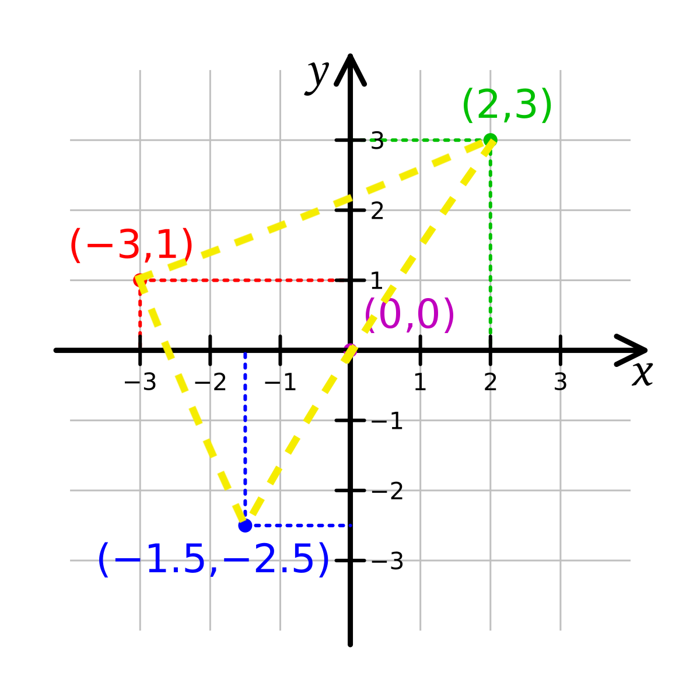

Lab - Functions and Methods in Go
=================================
Modfify the [geometry.go](./geometry.go) source code file and add the following features. The idea is to calculate the perimeter of the image.

1. A `main` function that will allow a cmdline parameter that will be called `sides`. The `sides` variable will serve to create an iregular figure.
2. Generate random points for all the figure's vertices. Values for vertice's point is in the range `(-100,100)`.
3. Make sure that the line segments of your figure doesn't intersect with the previously created lines. In case of intersection, fix it. Check this link for help in
[line segments intersection](https://www.geeksforgeeks.org/check-if-two-given-line-segments-intersect/).
4. Change the `Point` struct from `type Point struct{ X, Y float64 }` to `type Point struct{ x, y float64 }`.
5. Implement the `X` and `Y` (with Capitals)  methods  that will server for accessing the `x` and `y` values of your `Point` struct.
6. Below you can see an example on how your program should run and its output.

```
go run geometry.go 4
- Generating a [4] sides figure
- Figure's vertices
  - (  -3,   1)
  - (   2,   3)
  - (   0,   0)
  - (-1.5,-2.5)
- Figure's Perimeter
  - 5.38 + 3.60 + 3.92 + 3.80 = 16.70
```



General instructions
--------------------
1. Don't forget to do a `pull --rebase origin master` before anything.
2. Submit your code to your personal fork.
3. Use the  `geometry.go` file for your code.
4. Have fun and don't forget the next [section](#how-to-submit-your-work).


How to submit your work
=======================
```
GITHUB_USER=<your_github_user>  make submit
```
More details at: [Classify API](../../classify.md)